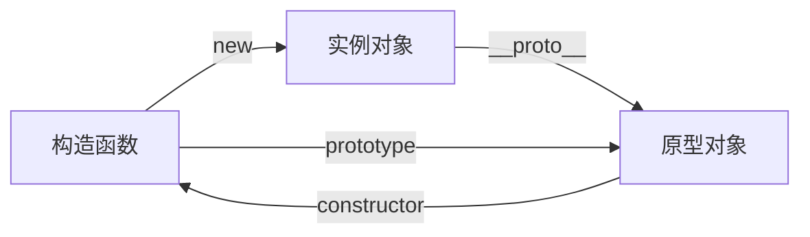

# front-end-interview

## vue

### 生命周期和钩子函数

vue 中每一个组件都有自己的生命周期，都会经过组件创建、数据初始化、挂载、更新、销毁等过程。在这个过程中会运行生命周期钩子函数，这使得用户有机会添加自己的代码。生命周期可以分为 8 个阶段：创建前后、挂载前后、更新前后、销毁前后。

| vue2          | vue3            | 调用时机          |
| ------------- | --------------- | ----------------- |
|               | setup           | 最开始            |
| beforeCreate  |                 | 组件实例初始化前  |
| created       |                 | 组件实例创建后    |
| beforeMount   | onBeforeMount   | 组件挂载到 DOM 前 |
| mounted       | onMounted       | 组件挂载到 DOM 后 |
| beforeUpdate  | onBeforeUpdate  | 组件更新前        |
| updated       | onUpdated       | 组件更新后        |
| beforeDestroy | onBeforeUnmount | 组件卸载前        |
| destroyed     | onUnmounted     | 组件卸载后        |

### 双向绑定原理

|      | 原理                                  | 区别                                                                 |
| ---- | ------------------------------------- | -------------------------------------------------------------------- |
| vue2 | 使用 es5 中的 Object.defineProperty() | 监听对象的所有属性，不能监听增加和删除的属性，不能监听数组，兼容性好 |
| vue3 | 使用 es6 中的 Proxy                   | 监听整个对象，可以监听增加和删除的属性，可以监听数组，兼容性不足     |

### 路由守卫

通过跳转或者取消跳转的方式，对路由导航进行守卫。

|                   | 调用位置 | 说明                                                         |
| ----------------- | -------- | ------------------------------------------------------------ |
| 全局路由守卫      |          |                                                              |
| beforeEach        | 前置守卫 | 每次路由切换之前被调用                                       |
| beforeResolve     | 解析守卫 | 在导航被确认之前、所有组件内守卫和异步路由组件被解析之后调用 |
| afterEach         | 后置守卫 | 每次路由切换之后调用                                         |
| 路由独享守卫      |          |                                                              |
| beforeEnter       | 前置守卫 | 只对单个路由配置和调用                                       |
| 组件路由守卫      |          |                                                              |
| beforeRouteEnter  | 进入守卫 | 进入该组件时被调用                                           |
| beforeRouteUpdate | 改变守卫 | 当前路由改变时被调用                                         |
| beforeRouteLeave  | 离开守卫 | 离开该组件时被调用                                           |

### v-show 与 v-if 区别

|        | 原理                    | 使用场景       |
| ------ | ----------------------- | -------------- |
| v-show | 操作 css 的显示隐藏属性 | 频繁切换时使用 |
| v-if   | 操作 dom 的销毁和创建   | 较少切换时使用 |

### 状态管理

对通用数据进行集中统一管理，相比普通组件的通信的方式，操作更加简洁，效率明显提高。

|          | vuex                                          | pinia                   |
| -------- | --------------------------------------------- | ----------------------- |
| state    | 状态数据，用来存储变量，只能有一个 store 实例 | 可以支持多个 store 实例 |
| geeter   | 相当于 state 的计算属性                       | 没变化                  |
| mutation | 提交更新数据的方法，同步的                    | 取消                    |
| action   | 先处理异步，再提交到 mutation                 | 同时支持同步和异步      |
| modules  | 模块化                                        | 取消                    |

### 组件传值

|          | vue2                                                              | vue3                          |
| -------- | ----------------------------------------------------------------- | ----------------------------- |
| 父传子   | 父组件通过自定义属性向子组件传值，子组件通过 props 接收           | 子组件改用 defineProps 宏函数 |
| 子传父   | 子组件通过 this.$emit()触发父组件绑定的自定义事件，父组件修改数据 | 子组件改用 defineEmits 宏函数 |
| 其他方式 | $bus、vuex 等                                                     | 依赖注入、pinia 等            |

### 路由导航传参

| 声明式导航 `<router-link>` | 传参                                                       | 接收                   | 特点     |
| -------------------------- | ---------------------------------------------------------- | ---------------------- | -------- |
| 查询参数传参               | `to="/path?参数名=值"`                                     | `$route.query.参数名`  | 拼接地址 |
| 动态路由传参               | `to="/path/值"` ；需要配置动态路由 `path: "/part/:参数名"` | `$route.params.参数名` | 拼接地址 |

| 编程式导航 `this.$router.push()` | 传参                                                                                              | 接收                   | 特点             |
| -------------------------------- | ------------------------------------------------------------------------------------------------- | ---------------------- | ---------------- |
| 路径跳转-查询参数传参            | `this.$router.push({path:"/path",query:{参数名:值}})`                                             | `$route.query.参数名`  | 拼接地址或 query |
| 路径跳转-动态路由传参            | `this.$router.push({path;'/path/值})'）`；需要配置动态路由 `path: "/part/:参数名"`                | `$route.params.参数名` | 拼接地址         |
| 命名路由跳转-查询参数传参        | `this.$router.push({name:'路由名',query:{参数名:值}})`                                            | `$route.query.参数名`  | query            |
| 命名路由跳转-动态路由传参        | `this.$router.push({name:'路由名',params:{参数名:值}})`；需要配置动态路由 `path: "/part/:参数名"` | `$route.params.参数名` | params           |

### vue2 与 vue3

|              | vue2                                  | vue3                              |
| ------------ | ------------------------------------- | --------------------------------- |
| API 语法     | 选项式 api                            | 组合式 api                        |
| 双向数据绑定 | 使用 es5 中的 Object.defineProperty() | 使用 es6 中的 Proxy               |
| 根节点       | 一个                                  | 多个                              |
| 生命周期     | 四个阶段，八个钩子                    | 使用 setup() 取代 vue2 的创建阶段 |
| diff 算法    | 虚拟 Dom 全量比较                     | 增加了静态标记，减少了比较次数    |

### computed 与 watch

| computed 计算属性    | watch 监听             |
| -------------------- | ---------------------- |
| 支持缓存             | 不支持缓存             |
| 不支持异步           | 支持异步               |
| 必须有返回值         | 直接修改 data 数据     |
| 一个数据依赖多个数据 | 多个数据依赖一个数据影 |
| 购物车总价           | 搜索数据               |

### route 与 router

| route                                   | router                                       |
| --------------------------------------- | -------------------------------------------- |
| 是一个路由对象                          | 是一个实例对象                               |
| 局部的                                  | 全局的                                       |
| 用于表示当前路由状态，path、name 等参数 | 用于声明和处理路由规则，跳转方法、钩子函数等 |

### vue2 数据视图不更新

原因：变动数组时，某些方法无法被监测 ；对象的属性添加或删除时，无法被监测。

解决：采用 vue.$set()方法、使用 v-if 的特性等

vue3 中 Object.defineProperty 改为 Proxy

### keep-alive

能在组件切换过程中将状态保留在内存中，缓存不活动的组件实例，而不是销毁它们，防止重复渲染 DOM

### 路由模式

|      | hash             | history                   |
| ---- | ---------------- | ------------------------- |
| 优点 | 兼容性比较好     | url 更加美观，不需要“#”号 |
| 切换 | 不会重新加载页面 | 需要服务器的支持          |
| 原理 | 锚点技术         | h5 history api            |

### 状态管理器 ⻚面刷新数据丢失

使用本地缓存或者借助第三方插件

### 插槽

插槽分为三种, 匿名插槽, 具名插槽, 作用域插槽. 通过插槽可以动态指定某一个组件模板部分的渲染

## css

### px em rem

px 是一个绝对单位

em 是一个相对单位,参考的是当前元素的字体大小

rem 是一个相对单位,参考的是页面根元素 html 的字体大小

### 结构选择器

|            |                 |
| ---------- | --------------- |
| 后代选择器 | 选择器1 选择器2 |
| 子代选择器 | 选择器1>选择器2 |


### 属性选择器

|              |                       |
| ------------ | --------------------- |
| 属性的或运算 | 选择器[属性名]        |
| 属性的与运算 | 选择器[属性1][属性2]  |
| 属性值的筛选 | 选择器[属性名='要求'] |

### 伪类选择器

|                |                |
| -------------- | -------------- |
| 动态伪类选择器 | a:hover等      |
| 结构伪类选择器 | E:nth-child(n) |


### 清除浮动

父元素设置高

父元素设置：overflow：hidden

使用伪元素

### css3 新增

媒体查询：@media

动画：animate

弹性布局：flex

### display:none 和 visibility:hidden 

display:none 隐藏元素后,不占位

visibility:hidden 隐藏元素后，占位

### css 三角形

元素的宽高均设置为 0，由元素的边框（border）控制三角形的形状，边框的颜色控制三角形的方向

```css
 {
  width: 0px;
  height: 0px;
  border-left: 50px solid transparent;
  border-right: 50px solid transparent;
  border-top: 0px solid transparent;
  border-bottom: 50px solid red;
}
```

### 选择器优先级

!important > 内联 > id > class > 标签 > 通配符

### position 定位

|          |          |                              |
| -------- | -------- | ---------------------------- |
| static   | 静态定位 | 元素的正常位置               |
| relative | 相对定位 | 相对于元素自身正常位置的偏移 |
| absolute | 绝对定位 | 相对于父级元素位置的偏移     |
| fixed    | 固定定位 | 相对于浏览器的位置的定位     |
| sticky   | 粘性定位 | 相对定位和固定定位的结合体   |

### flex 弹性布局 垂直水平居中

为父元素设置 flex 弹性布局

```css
 {
  display: flex;
  justify-content: center;
  align-items: center;
}
```

## js

### 数据类型

| 基本数据类型 值存在栈中 | 引用数据类型 引用地址存在堆中 值存在栈中 |
| ----------------------- | ---------------------------------------- |
| 数字（Number）          | 对象（Object）                           |
| 字符串（String）        | 数组（Array）                            |
| 布尔（Boolean）         | 函数（Function）                         |
| 空（Null）              |                                          |
| 未定义（Undefined）     |                                          |

### 深浅拷贝

基本数据类型不存在深浅拷贝问题，直接拷贝的就是值

引用数据类型存在深浅拷贝问题，直接拷贝的时引用地址

解决深拷贝问题；JSON 转换(JSON.parse(JSON.stringify()))、递归实现深拷贝、第三方库（lodash）

### var、 let、const 的区别

|       | 变量提升 | 块级作用域 | 重复声明 | 重复赋值 |
| ----- | -------- | ---------- | -------- | -------- |
| var   | 是       | 否         | 是       | 是       |
| let   | 否       | 是         | 否       | 否       |
| const | 否       | 是         | 否       | 否       |

### 原型链

一个实例对象通过__proto__指向它的原型对象,这个原型对象也会指向自己的原型对象...最终指向 null,这就是原型链。



### 判断数据类型

|                                  |                                       |                                                |
| -------------------------------- | ------------------------------------- | ---------------------------------------------- |
| typeof                           | 判断除对象、数组、null 的其他数据类型 |                                                |
| instanceof                       | 判断引用类型                          | 构造函数的原型对象是否出现在实例对象的原型链上 |
| Object.prototype.toString.call() | 准确判断                              | object 原型连上的 tostring 没有被重写          |

### 闭包

内层函数可以访问外层函数的变量

| 优点       | 缺点     |
| ---------- | -------- |
| 变量私有化 | 内存泄漏 |

### 防抖和节流

|      |                              |            |
| ---- | ---------------------------- | ---------- |
| 防抖 | 高频触发事件时，执行最后一次 | 搜索翻译   |
| 节流 | 高频触发事件时，执行第一次   | 拖动滚动条 |

### 判断俩个对象相等

先判断是不是对象，再判断key，最后判断value

### == 与 ===

==：判断值
===：判断值和类型

### 数组操作常用方法

push:将元素添加到数组的末尾, 返回值是数组长度 

pop:将数组最后一个元素弹出, 返回值是被弹出的元素 

unshift:在数组的开头插入一个元素,返回值是数组的长度 

shift:将数组第一个元素弹出,返回值是被弹出的元素 

splice(index,len):删除数组中指定元素 

concat:连接数组 

reverse: 翻转数组

### 字符串操作常用方法

substr(start,len)/substring(start,end): 截取字符串 

slice:从数组会字符串中截取一段  

indexOf/lastIndexOf:查找某一个字符是否存在于另外一个字符串中, 存在则返回索引, 不存在则返回-1

indexOf 是从前向后顺序查找 

lastIndexOf:是从后向前查找  

replace:替换字符串特定的字符  

toUpperCase:将字符串转成大写  

toLowerCase:将字符串转成小写  

charAt:获取字符串中指定索引的字符

### document.write 和 innerHTML

document.write 是指定在整个页面区域的内容

innerHTML 是指定某一个元素的内容

### 内存泄漏

内存泄漏是指本应该被垃圾回收机制回收的内存空间由于某种特殊原因没有及时被回收, 称之为内存泄漏

### this

谁调用就是谁

普通函数中指向全局 window;

对象的成员方法中指向该方法的宿主对象; 

构造函数中指向 new 出来的实例对象; 

事件处理函数中指向事件源; 

回调函数中指向全局 window

### call/apply/bind 的区别 

这三个方法都可以改this 的指向

不同点:  call 和 apply 会调用一次函数, 而 bind 不会调用函数

### new 操作符流程

第一步创建一个空对象; 

第二步将 this 指向空对象;  

第三步动态给刚创建的对象添加成员属性; 

第四步隐式返回 this

### ES6 新增特性

const(声明常量), let(声明变量)关键字;

 map 和 set 数据类型; 

模板字符串; 

对象数组解构赋值; 

函数剩余参数;(...arg) 

延展运算符;(...) 

函数默认参数;fn(name=’zs’) 

对象字面量的增强(属性名和属性值相同, 可缺省); Promise 异步对象; class 类的支持

### async/await

async 是用来修饰函数的声明, 使用async 修饰的函数会变成一个异步函数. await 用来修饰函数的调用, 被 await 修饰的函数必须返回一个promise 异步对象, 使用 await 修饰后, 就会将 promise 异步对象转换成一个同步操作

### Promise 的理解

改造或优化传统的使用回调函数实现的异步操作,  让我们以一种更优雅的方式来实现异步操作，解决回调地狱问题

## web

### cookie localstorage seesionstorage

|            | cookie             | localstorage         | seesionstorage       |
| ---------- | ------------------ | -------------------- | -------------------- |
| 大小       | 4k                 | 5m                   | 5m                   |
| 有效期     | 设置的有效之前有效 | 永久有效             | 当前会话下有效       |
| 服务器通信 | 参与服务器端通信   | 不参与服务器端的通信 | 不参与服务器端的通信 |


### 常见code码

200 - 请求成功
301 - 重定向
400 - 客户端请求错误
401 - token过期
403 - 禁止访问
404 - 请求的资源不存在
500 - 服务器错误

### http 和 https

|          | http | https    |
| -------- | ---- | -------- |
| 传输     | 明文 | 加密     |
| 验证     |      | 数字证书 |
| 响应速度 | 快   | 慢       |
| 端口     | 80   | 443      |

### 优化策略

减少http请求、避免频繁操作dom、压缩图片资源、按需加载、组件化等

### 同源策略  

同源策略是浏览器的一项安全策略, 浏览器只允许 js 代码请求和当前所在服务器域名,端口,协议相同的数据接口上的数据

### 跨域
jsonp、代理服务器、服务端配置cors

### DOM 元素增删改查的 API

创建 DOM: document.createElement(); 

查 找 DOM: 
document.querySelectorAll(); 
document.querySelector(); 

追加 DOM: parentDom.appendChild(); 

移除 DOM: parentDom.removeChild() 

### 主流浏览器注册事件

addEventListener("eventType","handler","true|false"); 

removeEventListner("eventType","handler","true|false"); 

### 事件委托

利用事件冒泡, 子元素的事件会向外冒泡, 触发父元素的相同事件, 根据事件对象可以找到真正触发事件的事
件源

### GET、POST

GET请求参数在URL中用户可以看见，POST的参数在请求体中不会被用户看见

GET请求在浏览器刷新或者回退的时候是无害的。POST的话数据会被重新提交

### ajax 工作原理 
第一步:创建对象 var xhr=new XMLHttpRequest() 
第二步:设置请求行 xhr.open(‘请求方式’,请求地址); 
第三步:发送请求 xhr.send(null), 

### 同步和异步

同步是指一个程序执行完了接着去执行另外一个程序

异步是指多个程序同时执行.  所以异步效率更高,

### 输入 URL 到页面加载的过程

域名查询 DNS 服务器获取服务器 IP

然后拿着服务器 IP 和域名请求对应的服务器

请求成功后 web 服务器会根据一系列运算, 将客户端需要的数据通过网络传输到客户端浏览器

最终由浏览器解析后呈现给终端用户

### 渐进增强和优雅降级 

渐进增强：针对低版本浏览器进行构建页面，保证最基本的功能，然后再针对高级浏览器进行效果、交互等改进和追加功能达到更好的用户体验。

优雅降级：一开始就构建完整的功能，然后再针对低版本浏览器进行兼容。

### 重排和重绘 

重排：当DOM的变化影响了元素的几何信息(元素的的位置和尺寸大小)，浏览器需要重新计算元素的几何属性，将其安放在界面中的正确位置，这个过程叫做重排。

重绘：当一个元素的外观发生改变，但没有改变布局,重新把元素外观绘制出来的过程，叫做重绘。

重排必定重绘，重绘不一定重排

### 单线程和多线程 

js是单线程, 单位时间内只能处理一个进程   
浏览器是多线程的, js 中的异步操作基本都是由浏览器提供的子线程来完成的.


## html

### html5新增标签

布局标签：header、footer等
多媒体标签：audio、video等
...

### 行内元素与块级元素

|      | 行内元素 | 块级元素 |
| ---- | -------- | -------- |
| 空间 | 共享一行 | 独占一行 |
| 标签 | span等   | div等    |

### readyonly 与 disabled 

readyonly 是设置表单元素为只读状态

disabled 是设置表单元素为禁用状态.

### 标签伪元素

大部分容器标签(大部分双标签)都有伪元素，iframe 没有伪元素

大部分单标签都没有伪元素, 但是 img 有伪元素

js不可以操作伪元素

### <!DOCTYOE HTML>?

HTML5 文档类型声明


