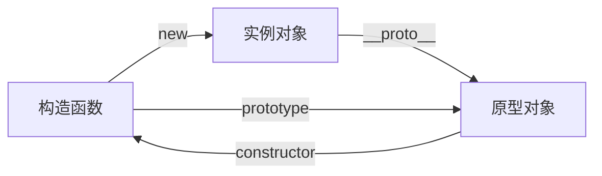

# front-end-interview

## vue

### 生命周期和钩子函数

vue 中每一个组件都有自己的生命周期，都会经过组件创建、数据初始化、挂载、更新、销毁等过程。在这个过程中会运行生命周期钩子函数，这使得用户有机会添加自己的代码。生命周期可以分为 8 个阶段：创建前后、挂载前后、更新前后、销毁前后。

| vue2          | vue3            | 调用时机          |
| ------------- | --------------- | ----------------- |
|               | setup           | 最开始            |
| beforeCreate  |                 | 组件实例初始化前  |
| created       |                 | 组件实例创建后    |
| beforeMount   | onBeforeMount   | 组件挂载到 DOM 前 |
| mounted       | onMounted       | 组件挂载到 DOM 后 |
| beforeUpdate  | onBeforeUpdate  | 组件更新前        |
| updated       | onUpdated       | 组件更新后        |
| beforeDestroy | onBeforeUnmount | 组件卸载前        |
| destroyed     | onUnmounted     | 组件卸载后        |

### 双向绑定原理

|      | 原理                                  | 区别                                                                 |
| ---- | ------------------------------------- | -------------------------------------------------------------------- |
| vue2 | 使用 es5 中的 Object.defineProperty() | 监听对象的所有属性，不能监听增加和删除的属性，不能监听数组，兼容性好 |
| vue3 | 使用 es6 中的 Proxy                   | 监听整个对象，可以监听增加和删除的属性，可以监听数组，兼容性不足     |

### 路由守卫

通过跳转或者取消跳转的方式，对路由导航进行守卫。

|                   | 调用位置 | 说明                                                         |
| ----------------- | -------- | ------------------------------------------------------------ |
| 全局路由守卫      |          |                                                              |
| beforeEach        | 前置守卫 | 每次路由切换之前被调用                                       |
| beforeResolve     | 解析守卫 | 在导航被确认之前、所有组件内守卫和异步路由组件被解析之后调用 |
| afterEach         | 后置守卫 | 每次路由切换之后调用                                         |
| 路由独享守卫      |          |                                                              |
| beforeEnter       | 前置守卫 | 只对单个路由配置和调用                                       |
| 组件路由守卫      |          |                                                              |
| beforeRouteEnter  | 进入守卫 | 进入该组件时被调用                                           |
| beforeRouteUpdate | 改变守卫 | 当前路由改变时被调用                                         |
| beforeRouteLeave  | 离开守卫 | 离开该组件时被调用                                           |

### v-show 与 v-if 区别

|        | 原理                    | 使用场景       |
| ------ | ----------------------- | -------------- |
| v-show | 操作 css 的显示隐藏属性 | 频繁切换时使用 |
| v-if   | 操作 dom 的销毁和创建   | 较少切换时使用 |

### 状态管理

对通用数据进行集中统一管理，相比普通组件的通信的方式，操作更加简洁，效率明显提高。

|          | vuex                                          | pinia                   |
| -------- | --------------------------------------------- | ----------------------- |
| state    | 状态数据，用来存储变量，只能有一个 store 实例 | 可以支持多个 store 实例 |
| geeter   | 相当于 state 的计算属性                       | 没变化                  |
| mutation | 提交更新数据的方法，同步的                    | 取消                    |
| action   | 先处理异步，再提交到 mutation                 | 同时支持同步和异步      |
| modules  | 模块化                                        | 取消                    |

### 组件传值

|          | vue2                                                              | vue3                          |
| -------- | ----------------------------------------------------------------- | ----------------------------- |
| 父传子   | 父组件通过自定义属性向子组件传值，子组件通过 props 接收           | 子组件改用 defineProps 宏函数 |
| 子传父   | 子组件通过 this.$emit()触发父组件绑定的自定义事件，父组件修改数据 | 子组件改用 defineEmits 宏函数 |
| 其他方式 | $bus、vuex 等                                                     | 依赖注入、pinia 等            |

### 路由导航传参

| 声明式导航 `<router-link>` | 传参                                                       | 接收                   | 特点     |
| -------------------------- | ---------------------------------------------------------- | ---------------------- | -------- |
| 查询参数传参               | `to="/path?参数名=值"`                                     | `$route.query.参数名`  | 拼接地址 |
| 动态路由传参               | `to="/path/值"` ；需要配置动态路由 `path: "/part/:参数名"` | `$route.params.参数名` | 拼接地址 |

| 编程式导航 `this.$router.push()` | 传参                                                                                              | 接收                   | 特点             |
| -------------------------------- | ------------------------------------------------------------------------------------------------- | ---------------------- | ---------------- |
| 路径跳转-查询参数传参            | `this.$router.push({path:"/path",query:{参数名:值}})`                                             | `$route.query.参数名`  | 拼接地址或 query |
| 路径跳转-动态路由传参            | `this.$router.push({path;'/path/值})'）`；需要配置动态路由 `path: "/part/:参数名"`                | `$route.params.参数名` | 拼接地址         |
| 命名路由跳转-查询参数传参        | `this.$router.push({name:'路由名',query:{参数名:值}})`                                            | `$route.query.参数名`  | query            |
| 命名路由跳转-动态路由传参        | `this.$router.push({name:'路由名',params:{参数名:值}})`；需要配置动态路由 `path: "/part/:参数名"` | `$route.params.参数名` | params           |

### vue2 与 vue3

|              | vue2                                  | vue3                              |
| ------------ | ------------------------------------- | --------------------------------- |
| API 语法     | 选项式 api                            | 组合式 api                        |
| 双向数据绑定 | 使用 es5 中的 Object.defineProperty() | 使用 es6 中的 Proxy               |
| 根节点       | 一个                                  | 多个                              |
| 生命周期     | 四个阶段，八个钩子                    | 使用 setup() 取代 vue2 的创建阶段 |
| diff 算法    | 虚拟 Dom 全量比较                     | 增加了静态标记，减少了比较次数    |

### computed 与 watch

| computed 计算属性    | watch 监听             |
| -------------------- | ---------------------- |
| 支持缓存             | 不支持缓存             |
| 不支持异步           | 支持异步               |
| 必须有返回值         | 直接修改 data 数据     |
| 一个数据依赖多个数据 | 多个数据依赖一个数据影 |
| 购物车总价           | 搜索数据               |

### route 与 router

| route                                   | router                                       |
| --------------------------------------- | -------------------------------------------- |
| 是一个路由对象                          | 是一个实例对象                               |
| 局部的                                  | 全局的                                       |
| 用于表示当前路由状态，path、name 等参数 | 用于声明和处理路由规则，跳转方法、钩子函数等 |

### vue2 数据视图不更新

原因：变动数组时，某些方法无法被监测 ；对象的属性添加或删除时，无法被监测。

解决：采用 vue.$set()方法、使用 v-if 的特性等

vue3 中 Object.defineProperty 改为 Proxy

### keep-alive

能在组件切换过程中将状态保留在内存中，缓存不活动的组件实例，而不是销毁它们，防止重复渲染 DOM

### 路由模式

|      | hash             | history                   |
| ---- | ---------------- | ------------------------- |
| 优点 | 兼容性比较好     | url 更加美观，不需要“#”号 |
| 切换 | 不会重新加载页面 | 需要服务器的支持          |
| 原理 | 锚点技术         | h5 history api            |

### 状态管理器 ⻚面刷新数据丢失

使用本地缓存或者借助第三方插件

### css 三角形

元素的宽高均设置为 0，由元素的边框（border）控制三角形的形状，边框的颜色控制三角形的方向

```css
 {
  width: 0px;
  height: 0px;
  border-left: 50px solid transparent;
  border-right: 50px solid transparent;
  border-top: 0px solid transparent;
  border-bottom: 50px solid red;
}
```

### 选择器优先级

!important > 内联 > id > class > 标签 > 通配符

### position 定位

|          |          |                              |
| -------- | -------- | ---------------------------- |
| static   | 静态定位 | 元素的正常位置               |
| relative | 相对定位 | 相对于元素自身正常位置的偏移 |
| absolute | 绝对定位 | 相对于父级元素位置的偏移     |
| fixed    | 固定定位 | 相对于浏览器的位置的定位     |
| sticky   | 粘性定位 | 相对定位和固定定位的结合体   |

### flex 弹性布局 垂直水平居中

为父元素设置 flex 弹性布局

```css
 {
  display: flex;
  justify-content: center;
  align-items: center;
}
```

### 数据类型

| 基本数据类型 值存在栈中 | 引用数据类型 引用地址存在堆中 值存在栈中 |
| ----------------------- | ---------------------------------------- |
| 数字（Number）          | 对象（Object）                           |
| 字符串（String）        | 数组（Array）                            |
| 布尔（Boolean）         | 函数（Function）                         |
| 空（Null）              |                                          |
| 未定义（Undefined）     |                                          |

### 深浅拷贝

基本数据类型不存在深浅拷贝问题，直接拷贝的就是值

引用数据类型存在深浅拷贝问题，直接拷贝的时引用地址

解决深拷贝问题；JSON 转换(JSON.parse(JSON.stringify()))、递归实现深拷贝、第三方库（lodash）

### var、 let、const 的区别

|       | 变量提升 | 块级作用域 | 重复声明 | 重复赋值 |
| ----- | -------- | ---------- | -------- | -------- |
| var   | 是       | 否         | 是       | 是       |
| let   | 否       | 是         | 否       | 否       |
| const | 否       | 是         | 否       | 否       |

### 原型链

一个实例对象通过__proto__指向它的原型对象,这个原型对象也会指向自己的原型对象...最终指向 null,这就是原型链。



### 判断数据类型

|                                  |                                       |                                                |
| -------------------------------- | ------------------------------------- | ---------------------------------------------- |
| typeof                           | 判断除对象、数组、null 的其他数据类型 |                                                |
| instanceof                       | 判断引用类型                          | 构造函数的原型对象是否出现在实例对象的原型链上 |
| Object.prototype.toString.call() | 准确判断                              | object 原型连上的 tostring 没有被重写          |

### 闭包